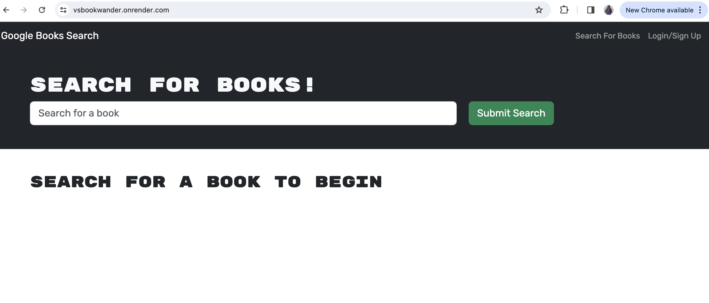
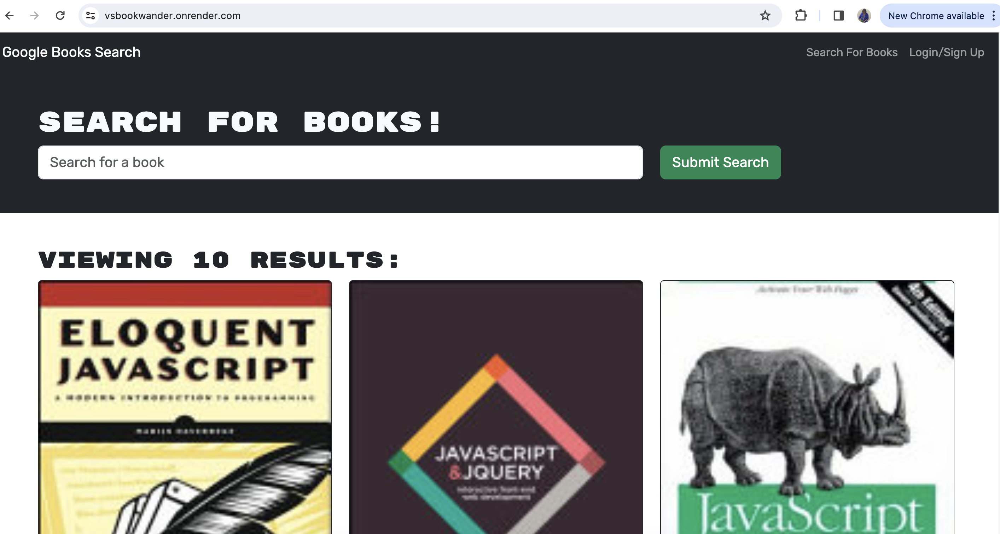
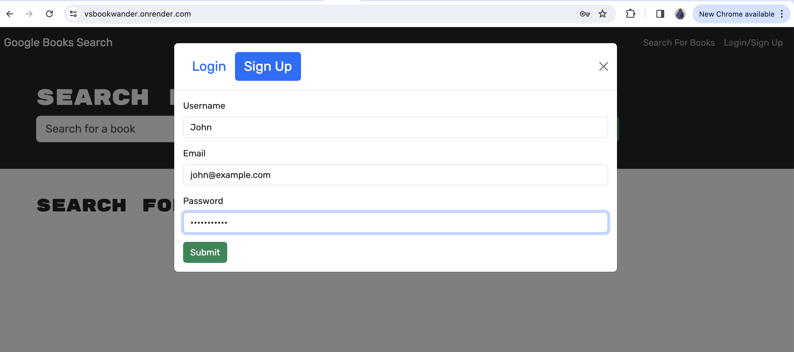
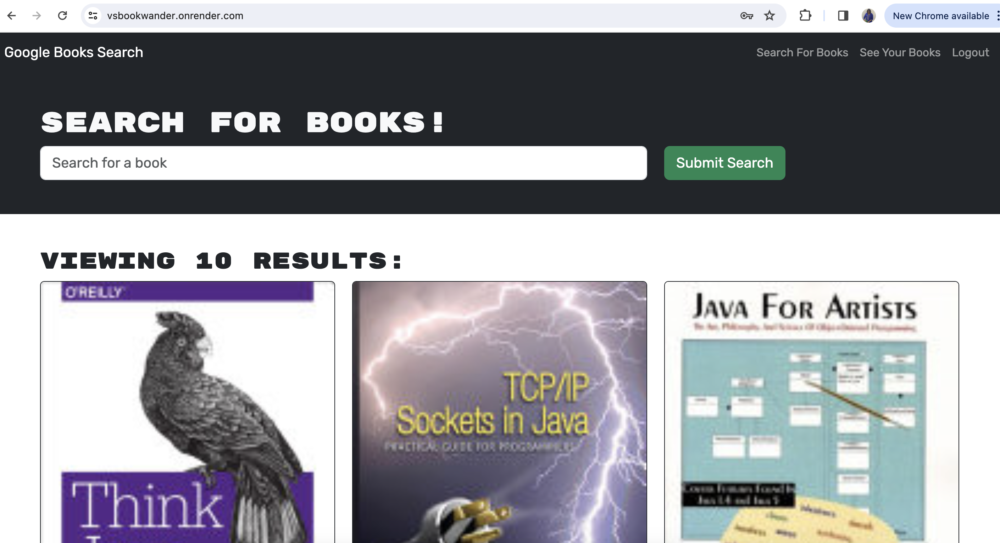
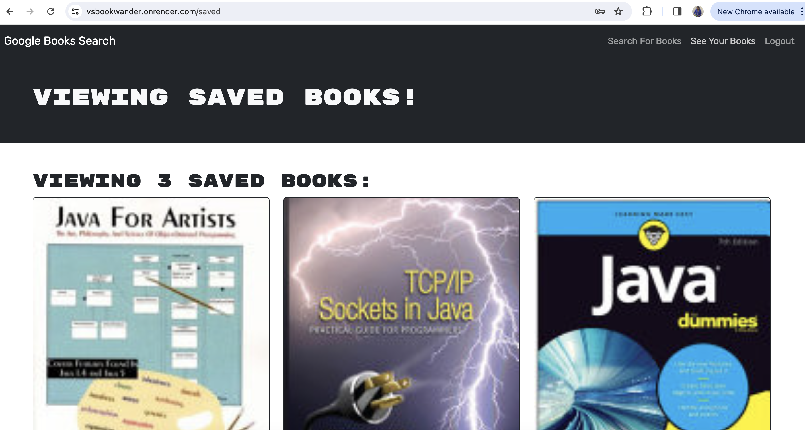
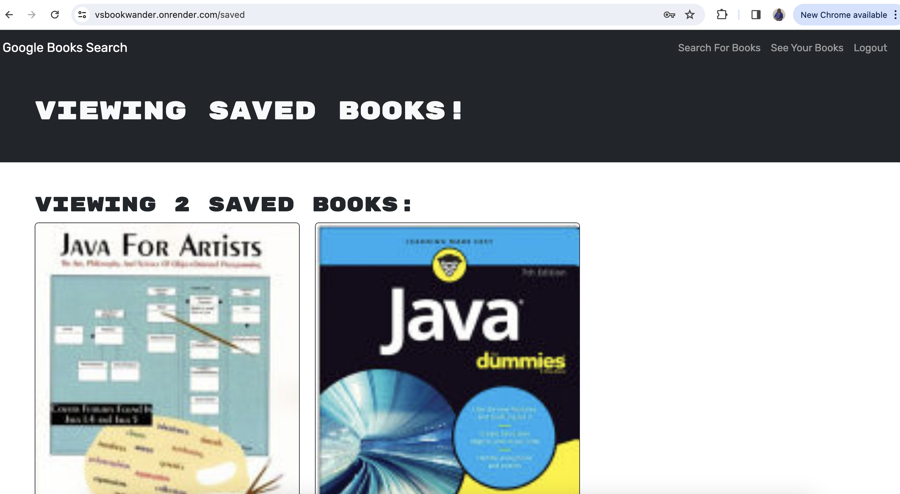

# VSBookWander

## Description
VSBookWander is a full-stack MERN application that allows users to search Google books and allows them to save them for future use. The application stores the book's details on local storage and database for users to access details irrespective of their browsers. To save the book's information, the application allows users to create an account in the portal, and once logged in, they can search and save the books. The saved books menu displays all the books for the logged-in user. The application also allows users to delete the saved books. The application uses Google APIs to search books, and MongoDB stores the book information. The application was developed using React JS and other server-side technologies like Node.js and Express.js and deployed on the Render platform. The application also uses JWT tokens to validate the users.

## Installation

To run or execute the application locally, one must have node installed in the system and other supporting packages mentioned in the package.json file.

To install Node.js, follow the guidelines mentioned in the link: https://nodejs.org/en/learn/getting-started/how-to-install-nodejs, 

## Usage

The deployed application can be accessed using the link https://vsbookwander.onrender.com

The application source code can be accessed using the link https://github.com/Vigneshwarie/VSBookWander

One can download the code from the above link. To use the application, one must install node.js, which is mentioned in the installation section. Open the package.json file in the integrated terminal of the vscode, and use the npm install command to install the other required supporting packages. To run the application, use the "npm run develop" command for the application to start on localhost.

On successful installation and execution, the application will run successfully and starts listening to the port. One can navigate to the browser and type localhost for the mentioned port. The application will display as below.

### Search Books without Login

### SignUp

### Search after Login

### List of saved Books

### After Delete

## Credits

The below link on render deployment was useful in understanding the render deployment process with MongoDB

https://coding-boot-camp.github.io/full-stack/mongodb/deploy-with-render-and-mongodb-atlas

## License

